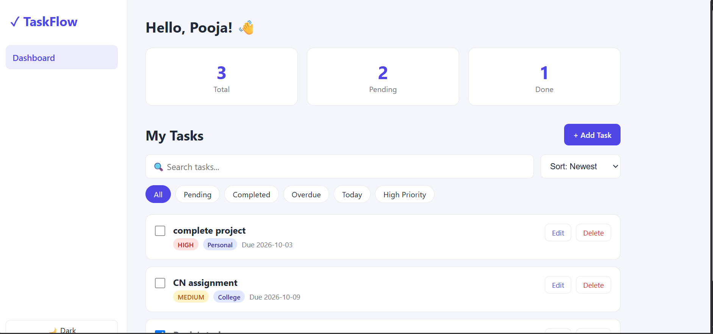
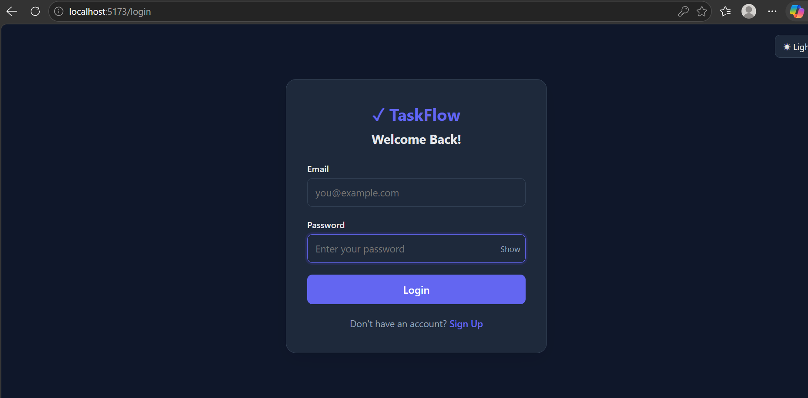
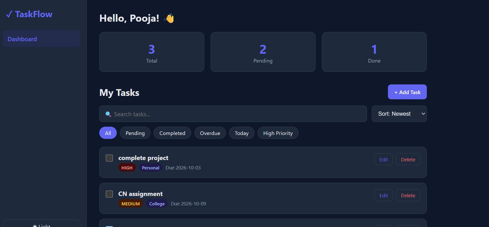
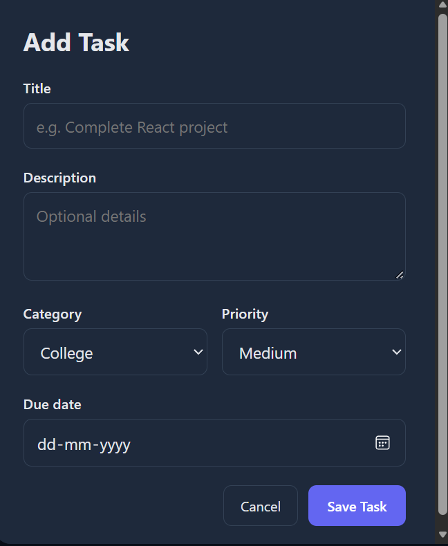
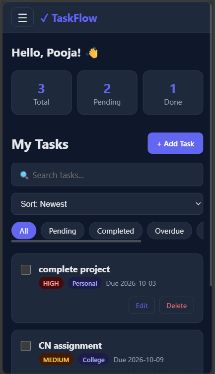

# ✓ TaskFlow

A full-stack task management app with user accounts, built with **React**, **Spring Boot** and **MySQL**.



## Features

- Register and log in with **JWT authentication**; passwords hashed with **BCrypt**
- Create, edit, delete and complete tasks
- Due dates, priorities (Low / Medium / High) and categories
- Search, filter (All, Pending, Completed, Overdue, Today, High Priority) and sort
- Dashboard statistics (total, pending, done)
- **Per-user data**: every task belongs to its owner, and other users' tasks return 404
- Dark / light mode, remembered between visits
- Responsive layout with a mobile navigation drawer
- Loading skeletons, toast notifications and friendly empty and error states
- Server-side validation with clear error messages

## Screenshots

| Login | Dark mode |
|---|---|
|  |  |

| Add task | Mobile |
|---|---|
|  |  |

## Tech stack

| Layer | Technologies |
|---|---|
| Frontend | React, Vite, React Router, Axios, Context API, CSS |
| Backend | Java 17, Spring Boot, Spring Web, Spring Data JPA, Spring Security, Bean Validation |
| Auth | JWT (HS256), BCrypt |
| Database | MySQL 8 |
| Tools | Git, GitHub, Postman, MySQL Workbench |

## Architecture

```
React (Vite)  →  REST API (JSON + Bearer token)  →  Spring Boot  →  MySQL
```

Backend request flow: `Controller → Service → Repository → MySQL`

```
taskflow/
├── frontend/   React app (pages, components, services, context)
├── backend/    Spring Boot API (controller, service, repository, entity, dto, config)
└── docs/       Screenshots
```

## Getting started

### Prerequisites

- Node.js 20+ and npm
- JDK 17 or newer
- MySQL 8

### 1. Clone

```bash
git clone https://github.com/madakapoojasri/taskflow.git
cd taskflow
```

### 2. Create the database

Run in MySQL:

```sql
CREATE DATABASE taskflow_db CHARACTER SET utf8mb4 COLLATE utf8mb4_unicode_ci;
CREATE USER 'taskflow_user'@'localhost' IDENTIFIED BY 'choose_a_password';
GRANT ALL PRIVILEGES ON taskflow_db.* TO 'taskflow_user'@'localhost';
FLUSH PRIVILEGES;
```

### 3. Configure and run the backend

Copy `backend/src/main/resources/application-local.properties.example` to `application-local.properties` in the same folder, and fill in your database password and a `jwt.secret` of at least 32 characters (for example `openssl rand -hex 32`).

```bash
cd backend
./mvnw spring-boot:run        # Windows: mvnw.cmd spring-boot:run
```

The API runs on `http://localhost:8080`. Tables are created automatically on first start.

### 4. Run the frontend

```bash
cd frontend
npm install
npm run dev
```

Open `http://localhost:5173`, register an account and start adding tasks.

## API documentation

All endpoints except `/api/auth/**` and `/api/health` need the header `Authorization: Bearer <token>`.

### Authentication

| Method | Endpoint | Description | Success |
|---|---|---|---|
| POST | `/api/auth/register` | Create an account and receive a token | 201 |
| POST | `/api/auth/login` | Log in and receive a token | 200 |

Register body:
```json
{ "name": "Pooja", "email": "pooja@example.com", "password": "Test1234" }
```
Response:
```json
{ "token": "eyJhbGciOi...", "name": "Pooja", "email": "pooja@example.com" }
```

### Tasks

| Method | Endpoint | Description | Success |
|---|---|---|---|
| GET | `/api/tasks` | List your tasks, newest first | 200 |
| GET | `/api/tasks/{id}` | Get one of your tasks | 200 |
| POST | `/api/tasks` | Create a task | 201 |
| PUT | `/api/tasks/{id}` | Update a task | 200 |
| PATCH | `/api/tasks/{id}/complete` | Toggle pending / completed | 200 |
| DELETE | `/api/tasks/{id}` | Delete a task | 204 |

Task body:
```json
{
  "title": "Complete React project",
  "description": "Finish the dashboard",
  "priority": "HIGH",
  "category": "Coding",
  "dueDate": "2026-10-05"
}
```
`title` is required. `priority` is `LOW`, `MEDIUM` (default) or `HIGH`. `dueDate` is optional (`YYYY-MM-DD`).

### Error responses

| Status | Meaning |
|---|---|
| 400 | Validation failed or malformed body (field errors are in `errors`) |
| 401 | Missing, invalid or expired token, or wrong login credentials |
| 404 | Task not found, **or it belongs to another user** |
| 409 | Email already registered |

## Security notes

- Passwords are stored as BCrypt hashes and never returned by the API.
- The user id comes from the signed JWT, never from the request body or URL, and every task query is filtered by owner.
- Secrets (`jwt.secret`, database password) live in a Git-ignored file.
- Validation runs on both the frontend and the backend.
- The token is stored in `localStorage`, which is simple but readable by any script on the page. A production app might use httpOnly cookies instead.

## Roadmap

- [ ] Custom user-defined categories
- [ ] Email verification and password reset
- [ ] Recurring tasks and reminders
- [ ] Drag-and-drop ordering
- [ ] Docker and CI/CD
- [ ] Automated tests

## License

Released under the [MIT License](LICENSE).

## Author

**Pooja Sri** · [GitHub](https://github.com/madakapoojasri)
